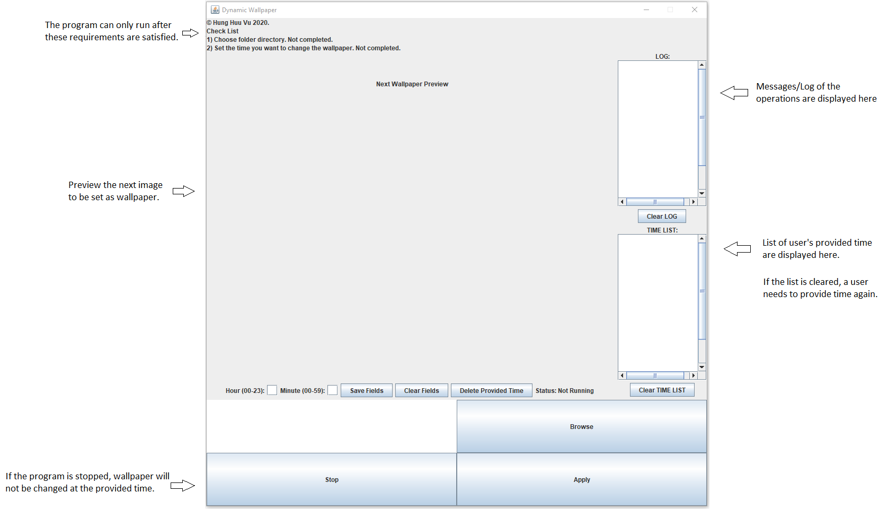

# Dynamic Wallpaper
- A small program, written in Java, allows users to automatically change their desktop wallpaper at a specific time in the day.
- Users will first choose their picture folder, then the program will **randomly** choose one image and set it as wallpaper.
- Initially, I'm learning on how Java interacts and modifies the OS, and coincidentally, my sister asked whether I know any kind of program that randomly changes wallpaper. Well, I don't know, so I decided to create one myself and here it is.

## Latest version
### [1.0.0.3] - 07-14-2020
- Packaged version, Open JDK 14.0.2 is included to improve portabiltiy.
- Compared to **v1.0.0.2**, there is no change in the source code.
### [1.0.0.2] - 06-17-2020 
- Contains only an executable (.exe) file.

## The GUI
<!---
 
//This is also a way to display image in markdown, but the img will not be displayed properly in published GitHub site
-->

## Note
- This program has been tested only on Window 10.
- This program is my out-of-class personal project, feel free to take a look over the code. I hope it can be helpful for you!
- I draw the icon for this program myself using Microsoft Paint. Just a simple icon contains the letters "D" and "W"! Then, I convert it to .ico file using [ICO CONVERTER](https://www.icoconverter.com/).
- The project and executable files uses/packages [JNA](https://github.com/java-native-access/jna) open library. I don't own nor be a contributor to the library. All rights reserved to their respective owners/contributors/creators.
- The project uses and redistributes the latest [Open JDK](https://jdk.java.net/14/) version, 14.0.2, as of 2020/07/14. I don't own nor be a contributor to the Open JDK. All rights reserved to its respective owners/contributors/creators.

## What I have struggle and learned about in this project
Major. These are new to me, so it's really nice to learn about them.
- The way to package .jar and runnable .jar, and how it performs based on my code (E.g: images must be inside a package to be exported to runnable jar, etc).
- How to convert .jar to .exe using Launch4j by Grzegorz Kowal.
- How to install and use external library ([JNA](https://github.com/java-native-access/jna)).
- How Java interact and modifies the OS.
- How to use GitHub (push, pull, backup, comment, etc).
- How to use [VisualVM](https://visualvm.github.io/features.html) by Jiri Sedlacek, and Tomas Hurka to observe heap usage of VM.

Minor. I already learned these concepts before, and this project help me improve my knowledge on them. Still, there is a long way to go.
- Garbage collection in Java (to fix memory leak issue).
- Static concept in Java.
- GUI design (properties of components, layouts, etc).
- Concurrency, thread design.
- Way to use checkstyle, PMD, surpress warning.

## License
This project is protected under GPLv2 license.  
Copyright (c) 2020 Hung Huu Vu
