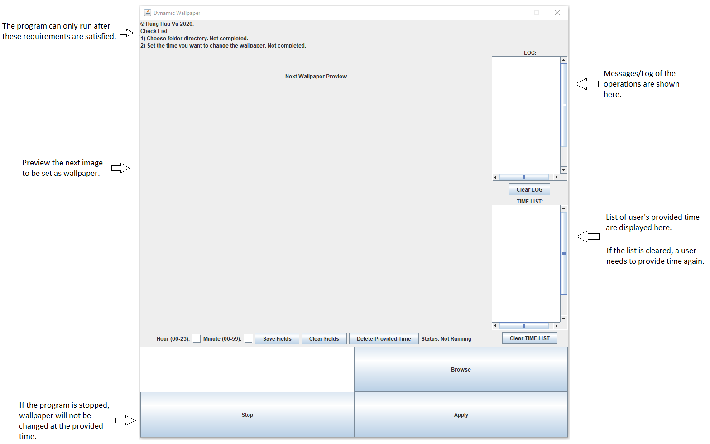
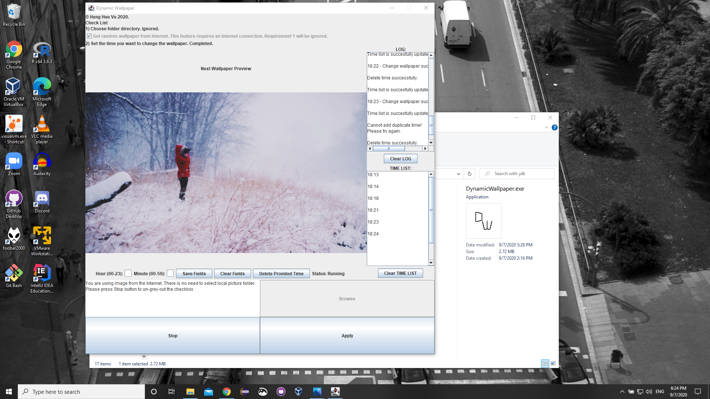

#   [Dynamic Wallpaper](https://hunghvu.github.io/dynamic-wallpaper/)

##  Description
-   A small program, written in Java, allows users to automatically change their desktop wallpaper at a specific time in the day.
-   Users can either choose their picture folder or choosing an option to get an image from Internet, then the program will **randomly** choose one image and set it as wallpaper.
-   Initially, I'm learning on how Java interacts and modifies the OS, and coincidentally, my sister asked whether I know any kind of program that randomly changes wallpaper. Well, I don't know, so I decided to create one myself and here it is.
-   This is only a personal/student (out-of-class) project that I do in my spare time. It is a DIY way for me to practice the concept that I've learned about, well, and it's FUN! Feel free to take a look over the code. I hope it can be helpful for you!

##  Latest version
- **[1.0.1.2](https://github.com/hunghvu/dynamic-wallpaper/releases/tag/v1.0.1.2) - 09/19/2020**

## Features
-   As of version [1.0.1.2](https://github.com/hunghvu/dynamic-wallpaper/releases/tag/v1.0.1.2):
    -   The timestamp is based on 24-hour military time.
    -   Randomly choose a picture in a designated folder and set it as wallpaper at a designated time stamp. For example, change the wall paper at **08:00 and 19:00**.
    -   Randomly choose a picture from the Internet and set it as wallpaper at a designated time stamp. For example, change the wall paper at **08:00 and 19:00**. This feature requires an Internet connection.

##  Basic guide (old version)
<!---

//This is also a way to display image in markdown, but the img will not be displayed properly in published GitHub site
-->
The GUI and functionality may change in a later version of the program, however, the use should work in a relatively same way.

##  Demo (old version)
-   The GUI and functionality may change in a later version of the program, however, the use should work in a relatively same way.
-   The images are taken from [Lorem Picsum](https://picsum.photos/).

##  Supported platforms
-   This program has been tested only on Windows 10, it should run properly on this platform.

##  Execution process
-   Download the archive/zip file [here](https://github.com/hunghvu/dynamic-wallpaper/releases/tag/v1.0.1.1).
-   Extract the archive/zip file.
-   Go inside the extracted folder, run DynamicWallpaper.exe (done).

##  Component sources
-   The project and executable files uses/packages [JNA](https://github.com/java-native-access/jna) open library. I don't own nor be a contributor to the library. All rights reserved to their respective owners/contributors/creators.
-   The project uses and redistributes the latest [Open JDK](https://jdk.java.net/14/) version, 14.0.2, as of 2020/07/14. I don't own nor be a contributor to the Open JDK. All rights reserved to its respective owners/contributors/creators.
-   The project uses images from and make API call(s) to [Lorem Picsum](https://picsum.photos/). I don't own nor be a contributor to the API, or the images. All righgts reserved to their respective owners/contributors/creators.
-   I draw the icon for this program myself using Microsoft Paint. Just a simple icon contains the letters "D" and "W"! Then, I convert it to .ico file using [ICO CONVERTER](https://www.icoconverter.com/).

##  Note
-   **About Lorem Picsum**:
    -   From version 1.0.1.1 and later on, this program will have API call(s) to [Lorem Picsum](https://picsum.photos/) to support new feature(s). This is also my attempt to work with RESTful API because I'm learning about that concept. Although this project is mainly used to support my self-learning process, I'm not entirely sure if publishing code (or executable file) with an API call to Lorem Picsum on GitHub is permitted. As I couldn't find a way to contact to Lorem Picsum staffs to ask about this matter, I want to experess my concern here.
    -   If anyone believes the mentioned action(s) isn't accepted, please notify me via my email so I can fix the problem. I'd like to have a discussion about this too as I'm actually curious about how API call is shown in an open source project/codebase.
    -   I also asked a question about this matter on [Open Source Stack Exchange](https://opensource.stackexchange.com/questions/10369/publish-code-on-github-with-a-call-to-public-api) too. I appreciate if you can go there and give your view on this matter.

##  What I have struggled and learned about in this project
**Major**. These are new to me, so it's really nice to learn about them.
-   **June - July (2020):**
    -   The way to package .jar and runnable .jar, and how it performs based on my code (E.g: images must be inside a package to be exported to runnable jar, etc).
    -   How to convert .jar to .exe using Launch4j by Grzegorz Kowal.
    -   How to install and use external library ([JNA](https://github.com/java-native-access/jna)).
    -   How Java interact and modifies the OS.
    -   How to use GitHub (push, pull, backup, comment, etc).
    -   How to use [VisualVM](https://visualvm.github.io/features.html) by Jiri Sedlacek, and Tomas Hurka to observe heap usage of VM.
-   **September (2020):**
    -   (Basic) concept of RESTful APIs.
    -   How to interact with RESTful APIs.
    -   (Basic) networking in Java.
    -   Using GitHub tools, pull request function.

**Minor**. I already learned these concepts before, and this project help me improve my knowledge on them. Still, there is a long way to go.
-   **June - July (2020):**
    -   Garbage collection in Java (to fix memory leak issue).
    -   Static concept in Java.
    -   GUI design (properties of components, layouts, etc).
    -   Concurrency, thread design.
    -   Way to use checkstyle, PMD, surpress warning.
-   **September (2020):**
    -   Concept and application of refactoring.

##  License
This project is licensed under GNU GPL-2.0-or-later.  
Copyright (C) 2020 Hung Huu Vu

